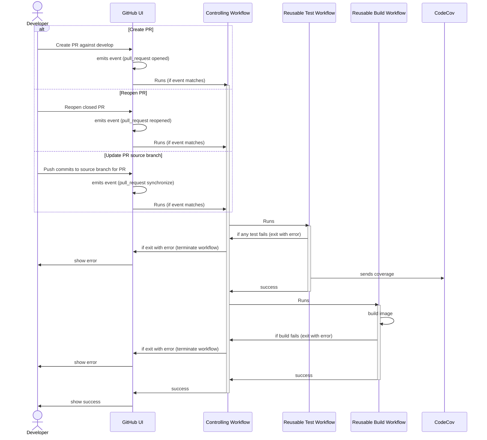

```mermaid
sequenceDiagram
    actor Developer
    participant GH as GitHub UI 
    participant Workflow as Controlling Workflow 
    participant TestWorkflow as Reusable Test Workflow 
    participant BuildWorkflow as Reusable Build Workflow
    participant CodeCov
    
    alt Create PR
        Developer ->> GH: Create PR against develop
        GH ->> GH: emits event (pull_request opened)
        GH ->> Workflow: Runs (if event matches)
        activate Workflow
    else Reopen PR
        Developer ->> GH: Reopen closed PR
        GH ->> GH: emits event (pull_request reopened)
        GH ->> Workflow: Runs (if event matches)
    else Update PR source branch
        Developer ->> GH: Push commits to source branch for PR
        GH ->> GH: emits event (pull_request synchronize)
        GH ->> Workflow: Runs (if event matches)
    end
    
    Workflow ->> TestWorkflow: Runs

    activate TestWorkflow
    TestWorkflow ->> Workflow : if any test fails (exit with error)
    Workflow ->> GH: if exit with error (terminate workflow)
    GH ->> Developer: show error
    TestWorkflow ->> CodeCov: sends coverage
    TestWorkflow ->> Workflow: success
    deactivate TestWorkflow
    
    Workflow ->> BuildWorkflow: Runs
    
    activate BuildWorkflow
    BuildWorkflow ->> BuildWorkflow: build image
    BuildWorkflow ->> Workflow: if build fails (exit with error)
    Workflow ->> GH: if exit with error (terminate workflow)
    GH ->> Developer: show error
    BuildWorkflow ->> Workflow:success
    deactivate BuildWorkflow
    
    Workflow ->> GH:success
    
    deactivate Workflow
    GH ->> Developer: show success
```