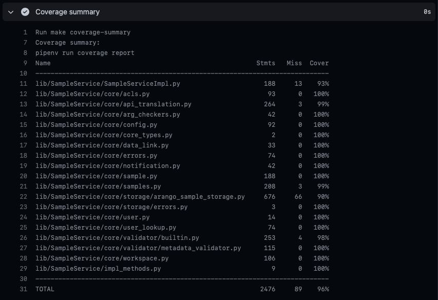
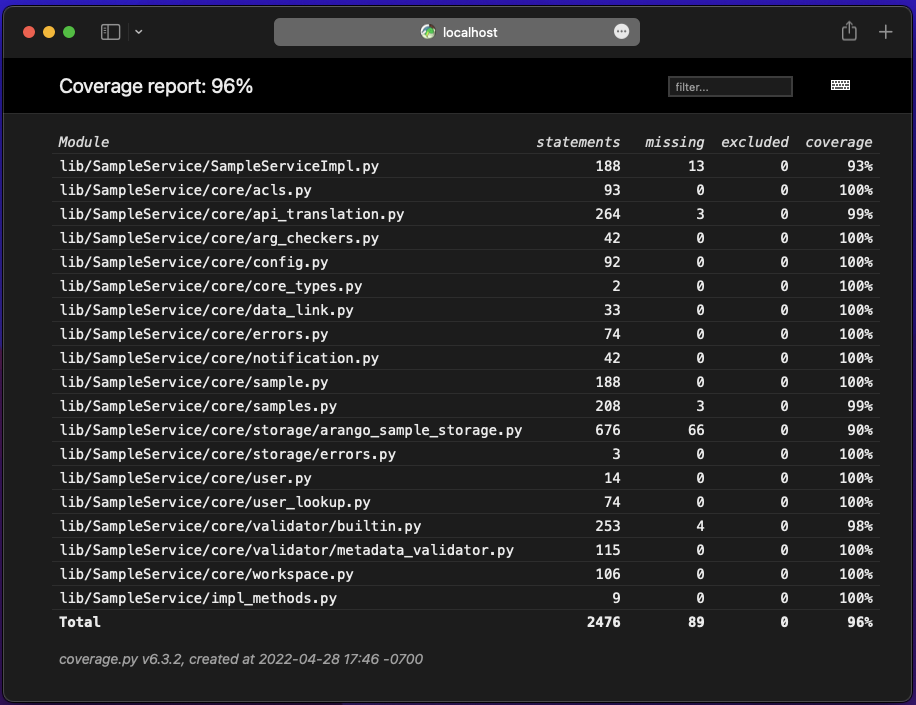

# Coverage

Coverage is collected by the Python unit and integration tests. The coverage data is initially stored in the top level file `.coverage`. From the coverage data file, reports are created; an html report for human consumption, and an lcov data file for usage by coverage services like [CodeCov](https://about.codecov.io).

## Configuration

Coverage requires only a single configuration file, `test/coveragerc`. We use the configuration to specify files we do not want covered. Typically this includes files the project has no control over and/or or generated by `kb_sdk`.

## Reporting

After tests run, two reports are created from this raw data. First, for human consumption,`htmlcov` contains a browsable report of all coverage, down to the file level. This report is very useful for determining which code has not yet been covered by tests, and making subsequent efforts to extend tests to cover such code.

The second report is actually an alternative form of coverage data. It contains the coverage data in "lcov" format, a common Linux coverage format which is broadly supported. We specifically use this file to provide to the [CodeCov service](https://about.codecov.io). 

## CodeCov

We use the free "CodeCov" service to provide access to coverage reports generated at GitHub by the GitHub Action Workflow.

The top level `README.md` file contains a CodeCov "badge" indicating the current coverage percentage for the master branch.

For a summary of coverage in the "develop" or any other branch, please see the GitHub action step "Coverage summary". 

For a detailed report of non-master branches, you will need to run the tests locally and look in `htmlcov`.

