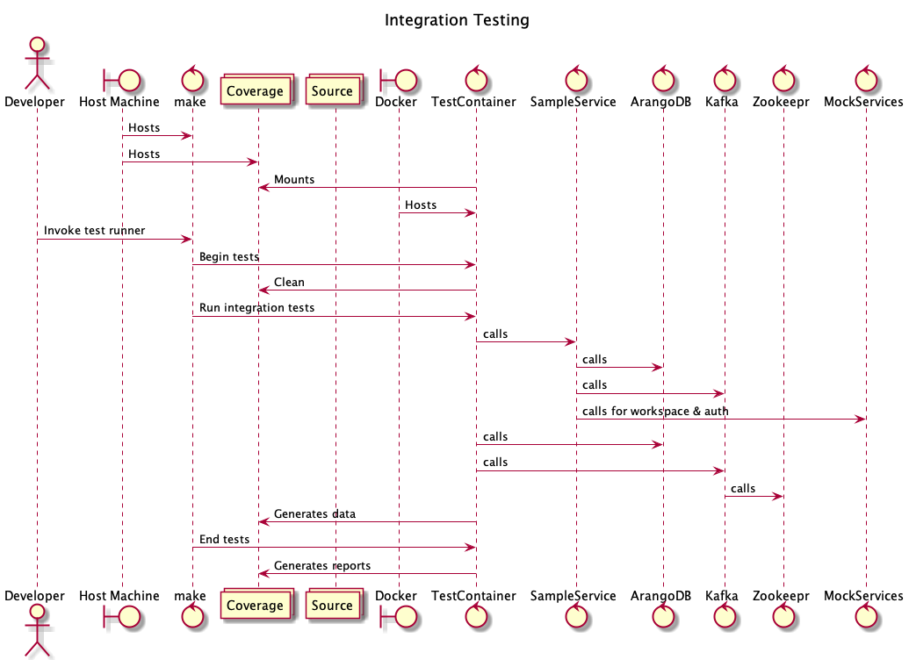
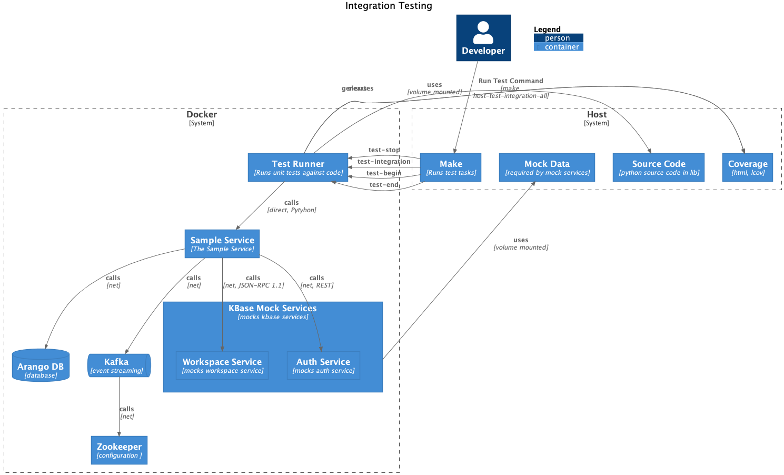

# Integration Tests

Integration tests require the source code as well as associated services, but not a running instance of the sample service itself. Therefore these tests require that the suite of dependent services be started before they are run. The distinguishing feature of integration tests is that they exercise aspects of the codebase which in turn communicate with services other than the _sampleservice_.

The basic invocation for integration tests is:

```shell
make host-test-integration-all
```

Which will

- create the test container
- ensure that sample service and dependent services are started
- run the integration tests inside the container
- create coverage a human-readable coverage report in `htmlcov` and an _lcov_ compatible file `cov_profile.lcov`

Note that although the _sampleservice_ is started as part of the docker compose orchestration, it is not actually utilized by integration tests.

## Diagrams

### Sequence Diagram

This diagram shows an overview of the sequence of actions involved in running unit tests



### C4 Process Diagram

This diagram shows the relationships between systems and system components.


