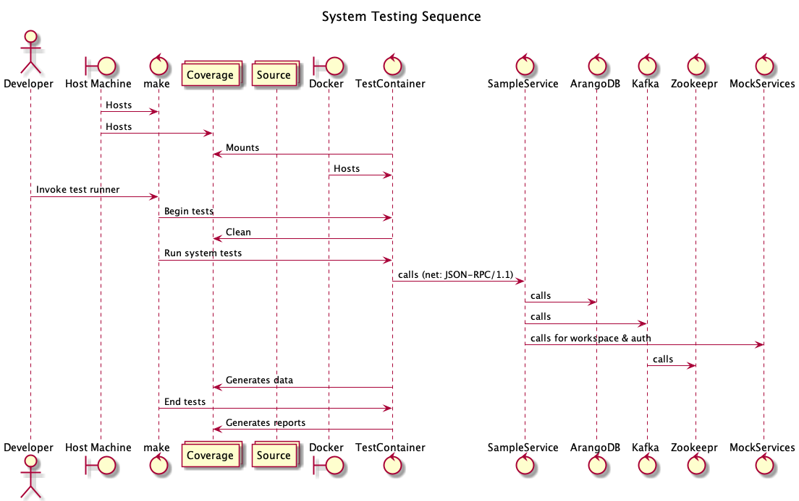
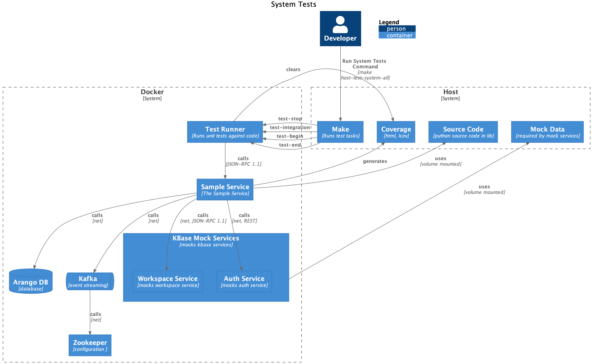

# System Tests

System tests are similar to integration tests, in that they require services to be running, but differ in that they do not directly invoke service source code. Rather, they invoke service network endpoints - sending parameters, inspecting results.

```shell
make host-test-system-all
```

See [system tests](./system-tests.md) for details

Since the code we are interested in for system tests is in the running sample service itself, coverage is configured for the `sampleservice` container via `sitecustomize.py` as well as the `test` entrypoint command for the 

In truth, system tests could be run from any language.

## Diagrams

### Sequence Diagram

This diagram shows an overview of the sequence of actions involved in running unit tests



### C4 Process Diagram

This diagram shows the relationships between systems and system components.


