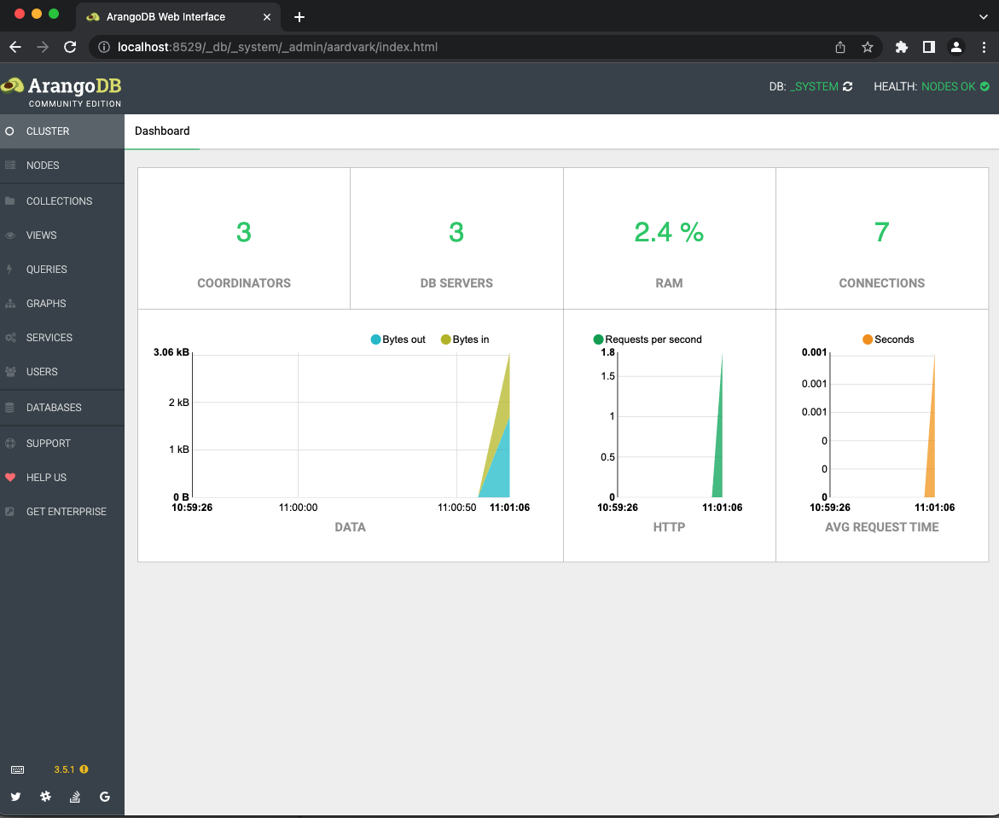
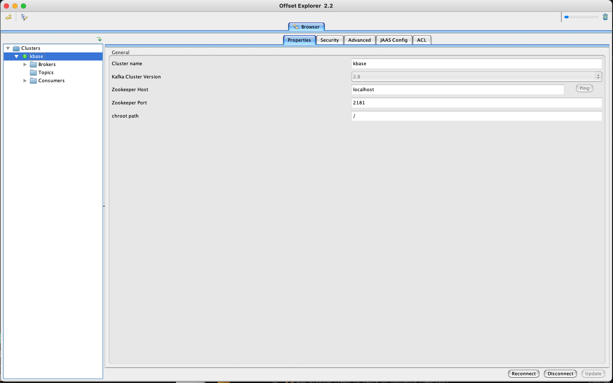

# Using Test Docker Compose

This document describes how to use and diagnose the test services run with docker compose. The test docker compose configuration defines services for ArangoDB, Kafka, Zookeeper, and MongoDB.

Each of these services operates inside the docker network, and is also exposed on the host machine on their usual ports.

- Arango: 8529
- Kafka: 9092, 9093
- Zookeeper: 2181
- mongod: 27017

These services will be utilized by integration tests which either operate directly against them, or utilize sample service functionality which depends upon their operation.

## Starting

Normally, test services are automatically started and stopped by the canonical `make test` task, in which case you do not need to bother with how these services run. 

However, there are certain situations, such as debugging the services (e.g. changing the version of a service), you may wish to start and stop them in isolation. 

The test services are started with a single `make` task defined in the top level `Makefile`.

```shell
make start-test-services
```

## Stopping

The test services may be stopped by **Ctrl-C** in the terminal in which they were started, or by running the following make task in another terminal.

```shell
make host-stop-test-services
```

Even if stopping with **Ctrl-C**, you should run the above make task to remove the test containers. Test containers will mount data directories, which will be populated during testing. Other than being good testing hygiene, the test startup script will assume that ArangoDB is empty and will attempt to create the expected collections. It will fail if the collections already exist.


## Inspecting via GUI Tools

It can be useful to inspect service dependencies to debug issues with tests. This section notes GUI clients which can be utilized with these services. Command line tools or the network interface to these services may be used as well, but that usage is not documented here.


### Arango

`arangodb` ships with the `Aardvark` gui tool. It is available when the service is started at port 8529. To launch the gui, just take your favorite browser to `http://localhost:8529`.



### Kafka and Zookeeper

`zookeeper` is an internal dependency of Kafka, and we should not need to bother with inspecting it.

`kafka` does not ship with a gui interface, but third party ones are available.

For instance, [Offset Explorer](https://offsetexplorer.com/index.html) is a cross-platform interface to both `kafka` and `zookeeper`.



## Assets

- `test/docker-compose-services.yml` - defines all services to be run during testing
- `Makefile` - defines tasks for starting and stopping services
  - `start-test-services` - start all test services
  - `stop-test-services` - stops all test servers, removes their respective containers

## Service Versions

All service versions specified in the docker compose file `test/docker-compose-services.yml` should closely match those utilized in deployment.

> TODO: There should be a documentation location which specifies the versions used in production, or the acceptable version ranges.