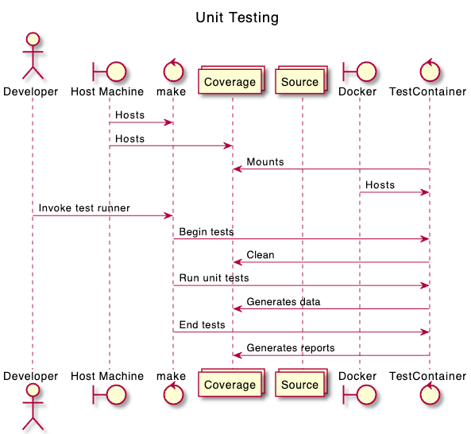
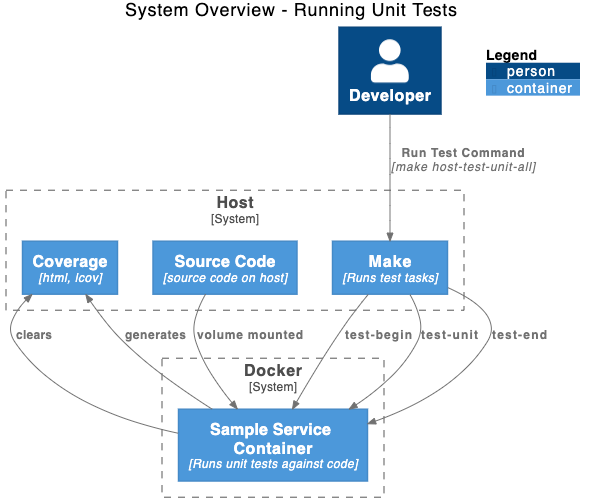

# Unit Tests

Unit tests require only the source code from the project and a suitable Python environment. They are run directly in the service container, and require only a simple docker-compose file, `test/docker-compose-unit.yml`, which creates and invokes a test container.

The test container is based on the service image but does not run the sample service upon startup.

Note that the make task is prefixed with `host-`. This indicates that the task is meant to be run on a host machine (developer, CI, etc.) rather than within the service instance (i.e. within the container.)

To run unit tests alone:

```shell
make host-test-unit-all
```

This invocation will:

- create the testing container
- run the unit tests inside the container
- create coverage a human-readable coverage report in `htmlcov` and an _lcov_ compatible file `cov_profile.lcov`

## Diagrams

### Sequence Diagram

This diagram shows an overview of the sequence of actions involved in running unit tests



### C4 Process Diagram

This diagram shows the relationships between systems and system components.


